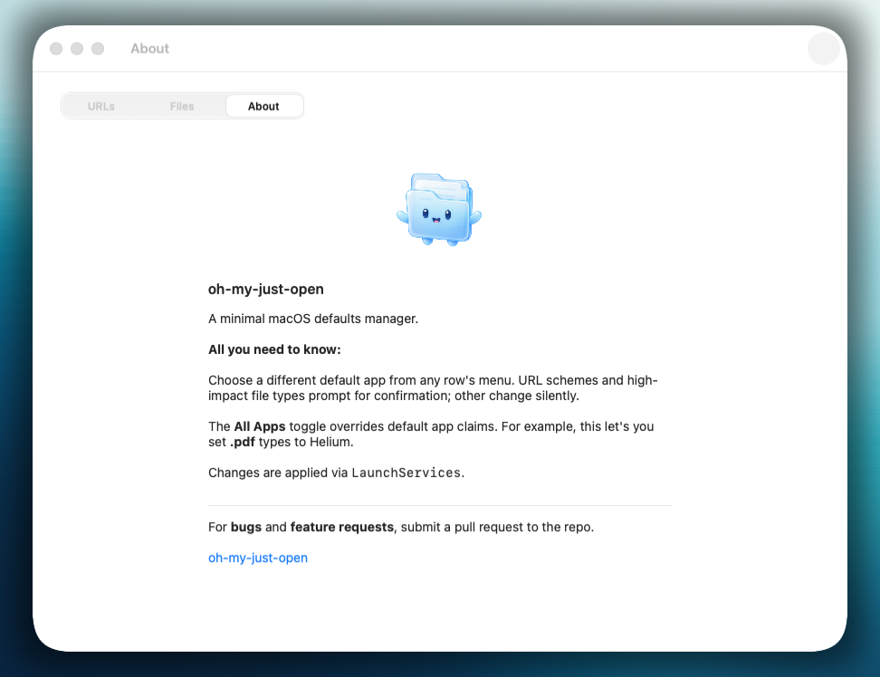
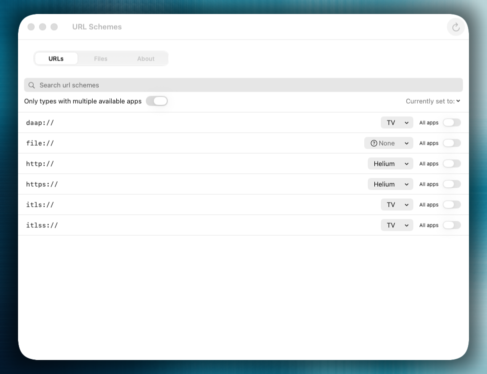
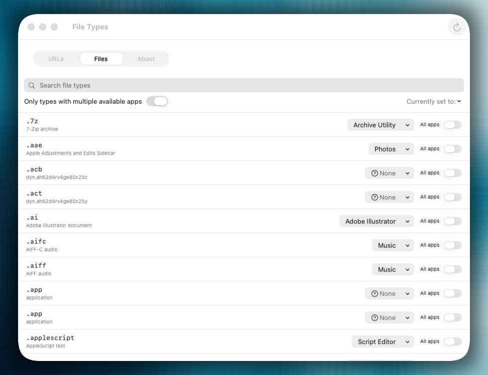

# homebrew-omjo (oh-my-just-open)
<div align="center">


[`oh-my-just-open`](https://github.com/blas0/mac-os-apps/tree/main/oh-my-just-open) — a minimal macOS default-app manager.

</div>

<div align="center">
<div center>


</div>
</div>

---

## Installation

```sh
brew tap blas0/omjo
brew install --cask oh-my-just-open
```

That's it. Brew strips the macOS quarantine flag for you, so the app launches normally on first run — no right-click-Open dance.

**Why a separate tap?**

The app ships ad-hoc signed instead of going through Apple's Developer ID + notarization workflow. The official `homebrew/cask` repo requires notarized apps, so the cask lives here instead. Once the upstream app starts notarizing again, this tap may move (or stay — it's lightweight).

**Updates**

`brew upgrade --cask oh-my-just-open` pulls the latest version. There is no in-app updater — Homebrew is the update channel.

**Pull requests**

Submit a PR if you have a feature/suggestion &or a bug discovered.

Source of truth for this tap is [`blas0/mac-os-apps`](https://github.com/blas0/mac-os-apps)
under `homebrew-omjo/` — open PRs there. The standalone `blas0/homebrew-omjo`
repo exists because Homebrew requires that name for `brew tap blas0/omjo` to
resolve; it is published to, not edited directly.

**Uninstall**

```sh
brew uninstall --cask oh-my-just-open
brew untap blas0/omjo            # optional
```

`brew uninstall --cask --zap oh-my-just-open` also clears the app's preferences and caches.

<br>

## oh-my-just-open

A more intuitive interface for setting default applications for specific file extensions. 

Yes you can probably just prompt your agent to do so – but that's overrated.

<div>
  
  <br>
  
  <br>
  
</div>

## License

The cask file is MIT-licensed. The app itself is also MIT — see [the upstream repo](https://github.com/blas0/mac-os-apps/blob/main/oh-my-just-open/LICENSE).
