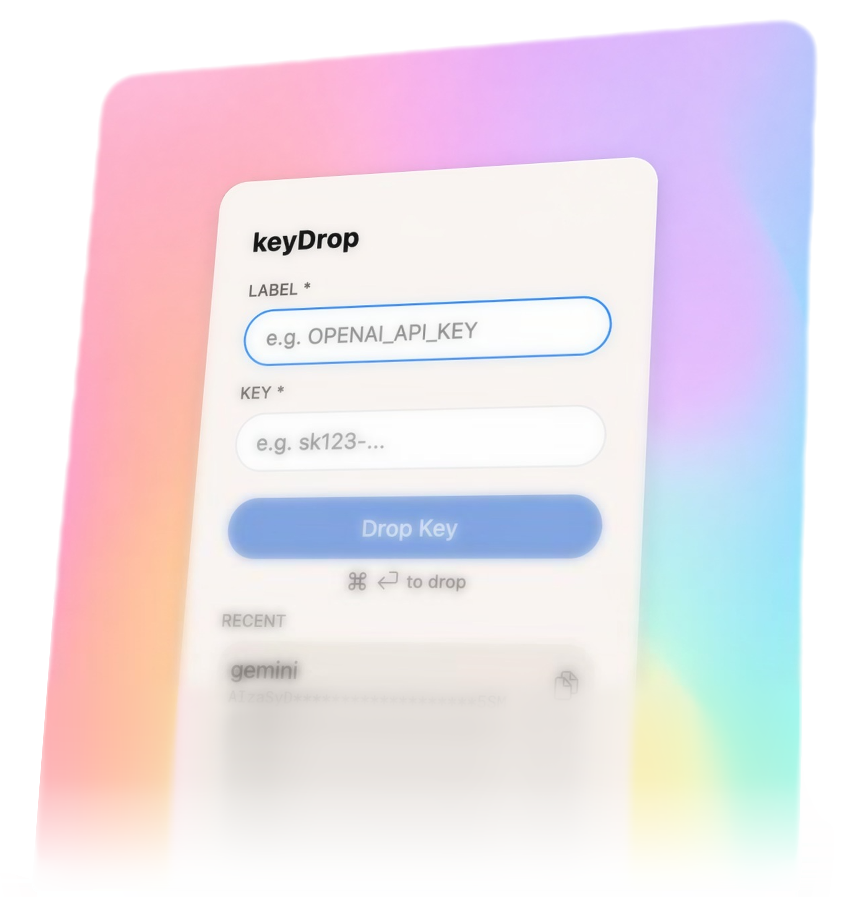
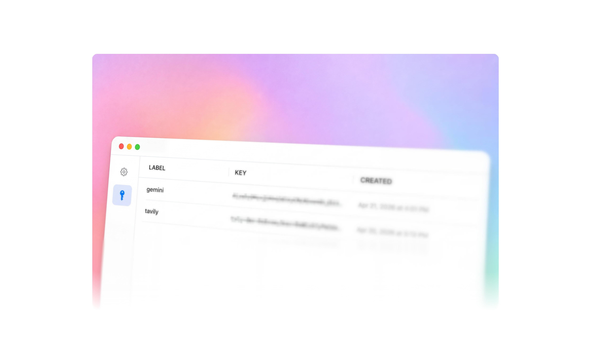

# README

<div align="center">

**Transparent source code for keyDrop**

A local, offline-only `API_KEY` storage menu-bar app. Using Mac OS native Keychain + Secure Enclave.





Install with Homebrew:

```sh
brew tap blas0/keydrop
brew install --cask keydrop
```

Updates ship with:

```sh
brew upgrade --cask keydrop
```

[keyDrop](https://www.neurix.co/keydrop) · [Source](https://github.com/blas0/keyDrop)

</div>

### Feature-flags
- `API_KEY` copy clipboard life
- Authentication grace limiting the pesky auth dialog pop-ups
- Launch at login
- View, edit, delete saved keys
